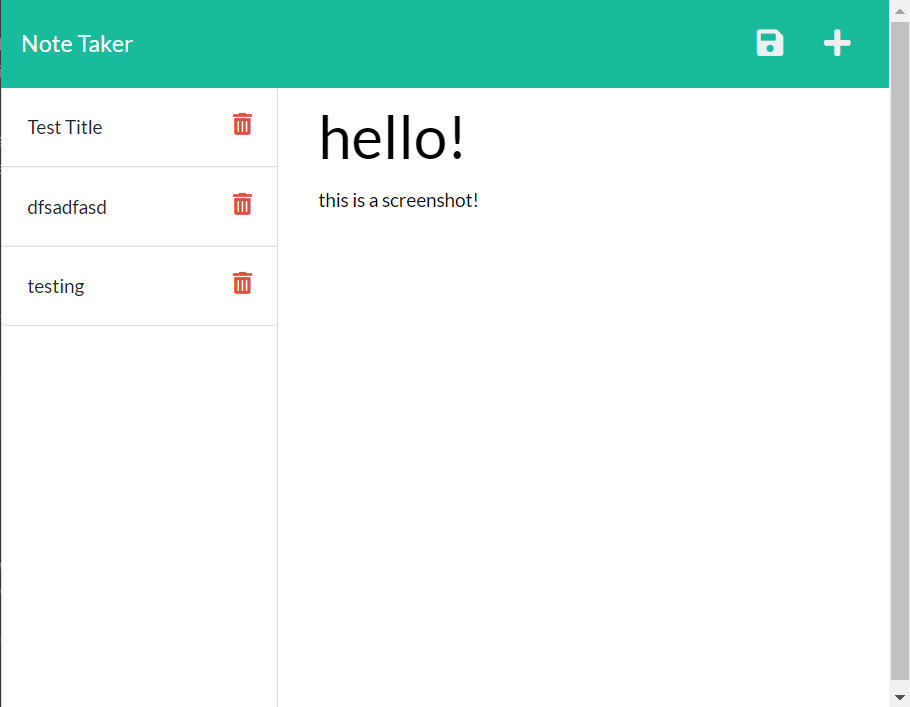

# create-notes

## Deployment link

https://enigmatic-ridge-02123.herokuapp.com/

## Description 

The goal for this application was to modify starter code to create a note taker application  that uses express.js and lets the user take and save notes. Then to deploy the application on Heroku.  

## Table of Contents
- [Installation](#installation)
- [Usage](#usage)
- [License](#license)
- [Questions](#questions)

## Installation

To run this application make sure to download the npm package express along with uuid for each note id. 

## Usage

Bellow I have provided screenshots to demonstrate the functionality of the application.

Here is what the application looks like upon loading.

When the user clicks get started, the route is changed to /notes and notes.html gets sent.

Here the user is free to start typing out their first note!

Once the user has typed out their note, they can hit the save icon (only is displayed after entering a title!) to save their note.Upon hitting save, the users note will pop up in the notes section on the left!

The user can view their saved notes by clicking on the title of saved note. 

When the user is ready to create a new note they can hit the plus icon at the top right!

## License

This application is covered under MIT license. 

## Questions

https://github.com/allysonnostrand

You can reach me at allyson.nostrandd@gmail.com if you have any questions!

